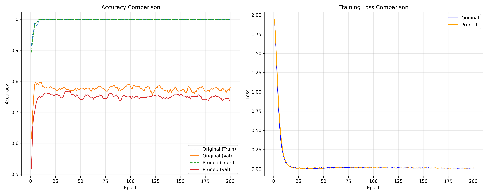
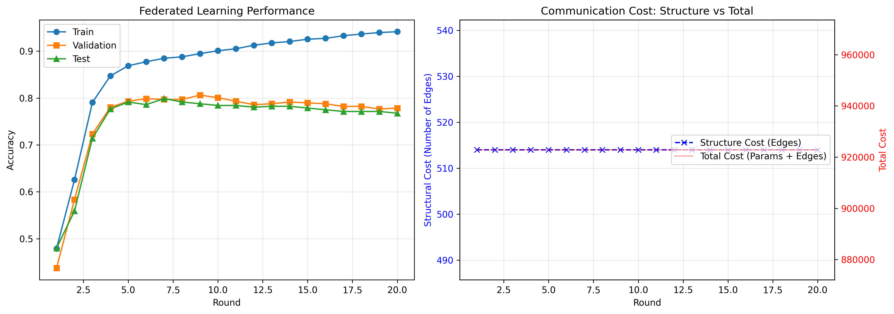
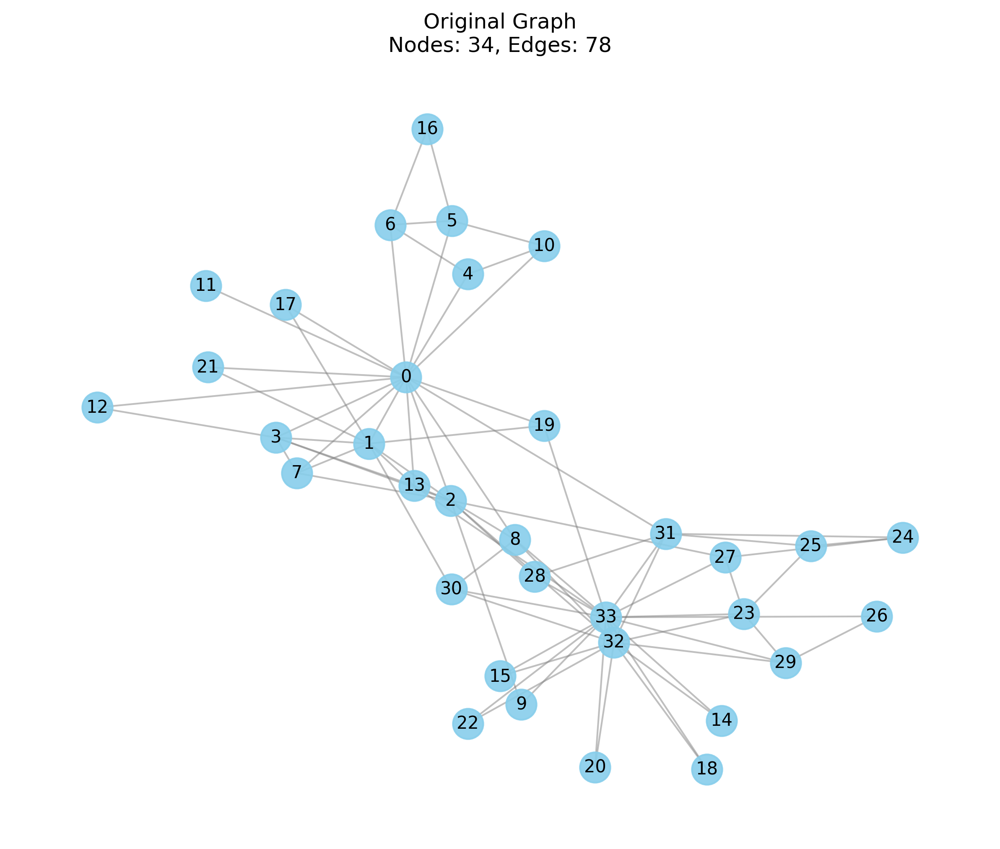
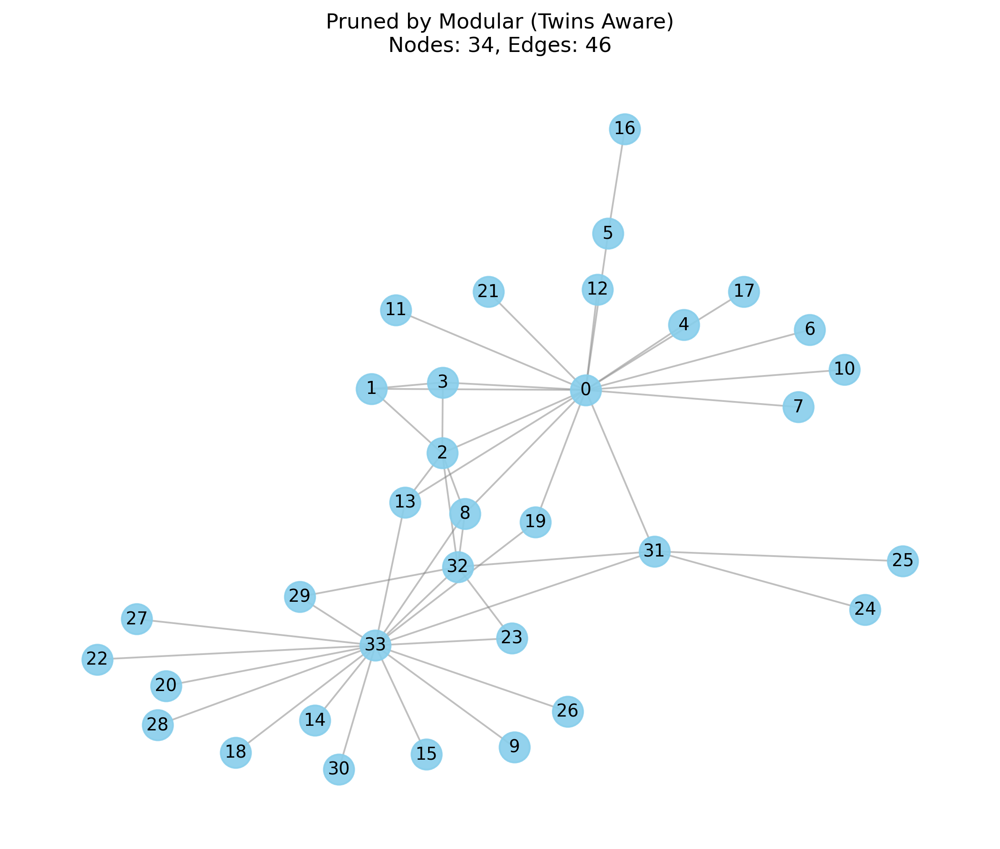

# Edge-GNP: On-Device Graph Pruning for Communication-Efficient Federated Learning

## 📋 Description

Edge-GNP est un projet de recherche combinant l'apprentissage fédéré (Federated Learning) et l'élagage de graphes pour l'entraînement distribué de réseaux de neurones graphiques (GNN) sur des terminaux à ressources limitées.

**Auteur:** Votre Nom  
**Cours:** Algorithmics, Complexity, and Graph Algorithms

## 🎯 Objectifs

L'objectif principal est d'apprendre les paramètres **w** d'un GNN qui minimise la perte agrégée tout en respectant des contraintes de communication:

```
min_{w, {G̃_i}} F(w)  s.c.  C_comm ≤ B
```

où:
- **w**: Paramètres du GNN
- **G̃_i**: Graphes élagués des clients
- **F(w)**: Fonction de perte agrégée
- **C_comm**: Coût de communication
- **B**: Budget de communication

## 📁 Structure du Projet

```
Edge-GNP/
├── graph_pruning.py            # Algorithmes d'élagage de graphes
├── gnn_model.py                # Modèles GNN (GCN, GraphSAGE, GAT)
├── federated_learning.py       # Système d'apprentissage fédéré
├── experiments.py              # Suite d'expérimentations
├── requirements.txt            # Dépendances Python
├── main.py                     # Script principal pour exécuter les expériences
└── README.md                   # Ce fichier
```

## 🔧 Installation

### 1. Créer un environnement virtuel (recommandé)

```bash
python -m venv venv
source venv/bin/activate  # Linux/Mac
# ou
venv\Scripts\activate  # Windows
```

### 2. Installer les dépendances

```bash
pip install -r requirements.txt
```

### 3. Installer PyTorch Geometric

**Pour CPU:**
```bash
pip install torch-scatter torch-sparse -f https://data.pyg.org/whl/torch-2.0.0+cpu.html
```

**Pour GPU (CUDA 11.8):**
```bash
pip install torch-scatter torch-sparse -f https://data.pyg.org/whl/torch-2.0.0+cu118.html
```

## 🚀 Utilisation

### Test des Algorithmes d'Élagage

```python
python graph_pruning.py
```

Ce script:
- Génère un graphe de test (Karate Club)
- Compare les 3 méthodes d'élagage:
  1. **Greedy Edge Pruning (MST Backbone)**: Élagage glouton avec garantie de connectivité
  2. **Spectral Sparsification**: Préservation du spectre du Laplacien
  3. **Modular Twin-Aware Pruning**: Élagage basé sur la décomposition modulaire (Habib)

### Test du GNN

```python
python gnn_model.py
```

Entraîne et évalue différents types de GNN:
- **GCN** (Graph Convolutional Network)
- **GraphSAGE**
- **GAT** (Graph Attention Network)

### Apprentissage Fédéré

```python
python federated_learning.py
```

Simule un système d'apprentissage fédéré avec:
- Plusieurs clients avec graphes locaux
- Élagage périodique des graphes
- Agrégation FedAvg
- Métriques de performance et communication

### Suite d'Expérimentations Complète (Benchmark)

Pour reproduire les résultats sur Cora :

```bash
python main.py --dataset cora --model gcn --experiment all --epochs 200
```

Cela va :
1. Télécharger le dataset Cora
2. Entraîner un GCN sur le graphe original (Baseline)
3. Élague le graphe avec l'approche Modulaire et ré-entraîner
4. Lancer une simulation d'apprentissage fédéré (10 clients)
5. Générer les courbes de résultats dans `Edge-GNP/images/`

## 📊 Algorithmes Implémentés

### 1. Greedy Edge Pruning (MST Backbone)

**Complexité:** O(m log m)

```python
pruner = GreedyEdgePruning(
    pruning_rate=0.3,
    importance_metric='betweenness'
)
G_pruned = pruner.prune(G)
```

Utilise une approche de type **Kruskal inverse** (MST) pour garantir la connectivité du graphe élagué tout en maximisant l'importance des arêtes conservées.

### 2. Spectral Graph Sparsification (SGS)

**Complexité:** O(mkn²) où k = nombre de valeurs propres

```python
pruner = SpectralGraphSparsification(
    pruning_rate=0.3,
    num_eigenvalues=10
)
G_pruned = pruner.prune(G)
```

Préserve les valeurs propres dominantes du Laplacien normalisé.

### 3. Modular Twin-Aware Pruning

**Complexité:** O(m log m)

```python
pruner = ModularAwarePruning(
    pruning_rate=0.3
)
G_pruned = pruner.prune(G)
```

Inspiré par la **Décomposition Modulaire** (travaux de Michel Habib), cet algorithme identifie les **Jumeaux** (Twins) :
- **False Twins**: N(u) = N(v)
- **True Twins**: N[u] = N[v]

Il pénalise les arêtes redondantes associées à ces structures pour un élagage structurellement intelligent.

## 📈 Modèles GNN

### Graph Convolutional Network (GCN)

```python
model = GCN(
    num_features=16,
    hidden_dim=64,
    num_classes=2,
    num_layers=2,
    dropout=0.5
)
```

**Équation de propagation:**
```
H^(l+1) = σ(D̃^(-1/2) Ã D̃^(-1/2) H^(l) W^(l))
```

### GraphSAGE

```python
model = GraphSAGE(
    num_features=16,
    hidden_dim=64,
    num_classes=2,
    aggregator='mean'  # 'mean', 'max', 'lstm'
)
```

### Graph Attention Network (GAT)

```python
model = GAT(
    num_features=16,
    hidden_dim=64,
    num_classes=2,
    num_heads=8
)
```

## 🔄 Apprentissage Fédéré

### Créer des Clients

```python
from federated_learning import FederatedClient

client = FederatedClient(
    client_id=0,
    graph=G,
    node_features=X,
    labels=y,
    train_mask=train_mask,
    val_mask=val_mask,
    test_mask=test_mask,
    pruner=GreedyEdgePruning(pruning_rate=0.3)
)
```

### Lancer Edge-GNP

```python
from federated_learning import EdgeGNPFederated, FederatedServer

# Serveur
server = FederatedServer(model_config)

# Système fédéré
edge_gnp = EdgeGNPFederated(
    clients=[client1, client2, client3],
    server=server,
    num_rounds=50,
    local_epochs=5,
    client_fraction=1.0,
    prune_every=5
)

# Entraînement
history = edge_gnp.run()

# Visualisation
edge_gnp.plot_results(save_path='results.png')
```


## 🧪 Expérimentations et Résultats

### 1. Classification sur Cora (Centralisé)

Nous avons comparé les performances du GCN sur le graphe original et les graphes élagués.

| Méthode | Taux d'Élagage | Arêtes | Accuracy |
|---------|----------------|--------|----------|
| Original | 0% | 100% (5278) | **80.30%** |
| Modular (Twins) | ~50% | 51.3% (2707) | 77.90% |

> **Observation**: L'élagage modulaire réduit le graphe de moitié tout en conservant une précision très proche de la baseline.



### 2. Apprentissage Fédéré

Simulation avec 10 clients (partition IID du graphe Cora).

- **Convergence**: 50 rounds
- **Efficacité**: Le modèle apprend efficacement malgré la sparsification locale continue (Modular Twin-Aware Pruning).



### 3. Visualisation de l'Élagage

Comparaison visuelle des structures de graphes :

| Original | Modular Pruned |
|----------|----------------|
|  |  |

## 🔍 Analyse de Complexité

| Algorithme | Complexité Temps | Complexité Espace |
|------------|------------------|-------------------|
| Greedy (MST Backbone) | O(m log m) | O(n + m) |
| Spectral Sparsification | O(mkn²) | O(n²) |
| Modular/Twin-Aware | O(m log m) | O(n + m) |
| Edge-GNP (par round) | O(N·m log m + N·E·T_GNN) | O(Np) |

où:
- **ρ**: Taux d'élagage
- **m**: Nombre d'arêtes
- **n**: Nombre de nœuds
- **k**: Nombre de valeurs propres
- **N**: Nombre de clients
- **E**: Époques locales
- **p**: Nombre de paramètres du modèle


## 🛠️ Développement Futur

- [ ] Élagage dynamique adaptatif
- [ ] Pruning différentiel pour confidentialité
- [ ] Support pour graphes hétérogènes
- [ ] Optimisation multi-objectifs
- [ ] Compression des paramètres GNN
- [ ] Benchmark sur datasets réels (Cora, CiteSeer, PubMed)

## 📧 Contact

Pour toute question sur le projet:
- **Email:** [Joshua.YUN-PEI@um6p.ma]
- **GitHub:** https://github.com/Yunpei24/Edge-GNP.git

## 📜 Licence

Ce projet est développé dans un cadre académique pour le cours "Algorithmics, Complexity, and Graph Algorithms".

## 🙏 Remerciements

- Professeur du cours Professeur Emerite Michel Habib pour les orientations
- Communauté PyTorch Geometric pour les outils GNN
- Travaux de recherche de McMahan et al. (FedAvg), Kipf & Welling (GCN)

---

**Note:** Ce projet est un prototype de recherche. Pour une utilisation en production, des optimisations supplémentaires et des tests de robustesse sont nécessaires.
