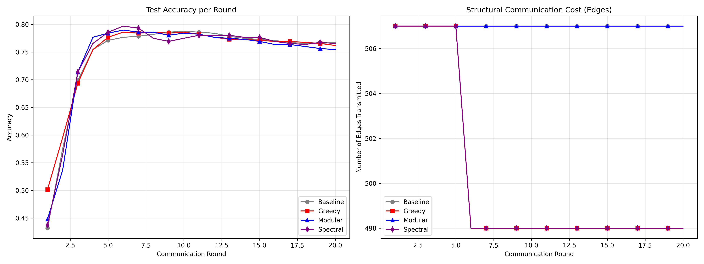
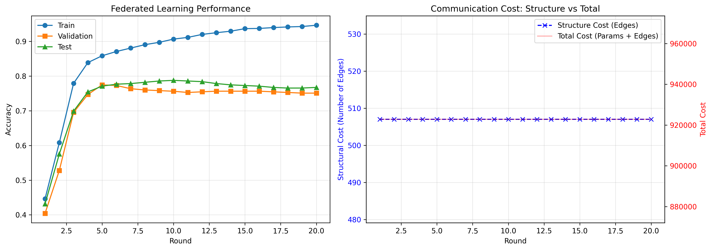
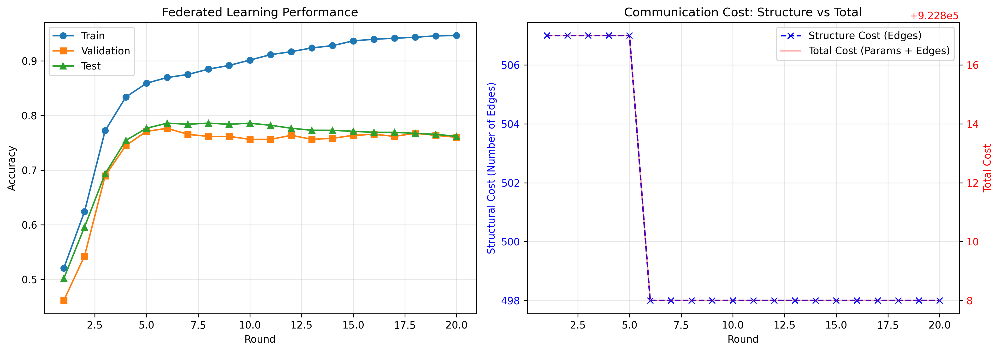
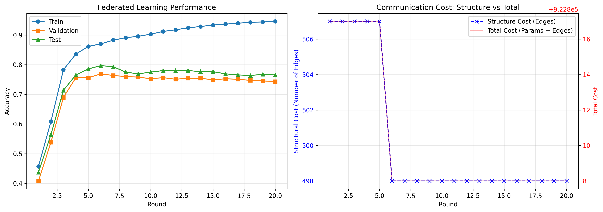
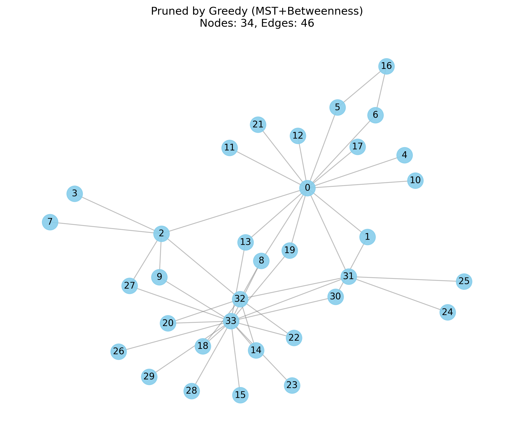

# Edge-GNP: On-Device Graph Pruning for Communication-Efficient Federated Learning

## 📋 Description

Edge-GNP est un projet de recherche combinant l'apprentissage fédéré (Federated Learning) et l'élagage de graphes pour l'entraînement distribué de réseaux de neurones graphiques (GNN) sur des terminaux à ressources limitées.

**Auteur:** Votre Nom  
**Cours:** Algorithmics, Complexity, and Graph Algorithms

## 🎯 Objectifs

L'objectif principal est d'apprendre les paramètres **w** d'un GNN qui minimise la perte agrégée tout en respectant des contraintes de communication:

```
min_{w, {G̃_i}} F(w)  s.c.  C_comm ≤ B
```

où:
- **w**: Paramètres du GNN
- **G̃_i**: Graphes élagués des clients
- **F(w)**: Fonction de perte agrégée
- **C_comm**: Coût de communication
- **B**: Budget de communication

## 📁 Structure du Projet

```
Edge-GNP/
├── graph_pruning.py            # Algorithmes d'élagage de graphes
├── gnn_model.py                # Modèles GNN (GCN, GraphSAGE, GAT)
├── federated_learning.py       # Système d'apprentissage fédéré
├── experiments.py              # Suite d'expérimentations
├── requirements.txt            # Dépendances Python
├── main.py                     # Script principal pour exécuter les expériences
└── README.md                   # Ce fichier
```

## 🔧 Installation

### 1. Créer un environnement virtuel (recommandé)

```bash
python -m venv venv
source venv/bin/activate  # Linux/Mac
# ou
venv\Scripts\activate  # Windows
```

### 2. Installer les dépendances

```bash
pip install -r requirements.txt
```

### 3. Installer PyTorch Geometric

**Pour CPU:**
```bash
pip install torch-scatter torch-sparse -f https://data.pyg.org/whl/torch-2.0.0+cpu.html
```

**Pour GPU (CUDA 11.8):**
```bash
pip install torch-scatter torch-sparse -f https://data.pyg.org/whl/torch-2.0.0+cu118.html
```

## 🚀 Utilisation

### Activation de l'Environnement Virtuel

```bash
source venv/bin/activate  # Linux/Mac
# ou
venv\Scripts\activate  # Windows
```

### 🧪 Commandes de Test Complètes

#### 1. Test Rapide des Algorithmes d'Élagage

```bash
python graph_pruning.py
```

**Ce que cela fait** :
- Génère un graphe de test (Karate Club, 34 nœuds)
- Compare les 3 méthodes d'élagage (Greedy, Spectral, Modular)
- Affiche les métriques de performance
- Génère des visualisations dans `images/`

**Sortie attendue** :
```
=== Greedy Edge Pruning ===
Original edges: 78, Pruned edges: 54 (-30.8%)
Clustering preserved: 92.3%
Spectral distance: 0.145
Time: 0.023s

=== Spectral Sparsification ===
...
```

---

#### 2. Expériences Centralisées sur Cora (Baseline + Pruning)

```bash
# Baseline (graphe original)
python experiments.py --mode centralized --dataset cora --pruning none --epochs 200

# Greedy MST Pruning
python experiments.py --mode centralized --dataset cora --pruning greedy --rate 0.5 --epochs 200

# Modular Twin-Aware Pruning
python experiments.py --mode centralized --dataset cora --pruning modular --rate 0.5 --epochs 200

# Spectral Pruning
python experiments.py --mode centralized --dataset cora --pruning spectral --rate 0.5 --epochs 200
```

**Résultats générés** :
- Graphes élagués : `images/original.png`, `images/greedy_pruned.png`, `images/modular_pruned.png`
- Métriques de performance sauvegardées dans les logs

---

#### 3. Expériences Fédérées (Comparaison de Toutes les Méthodes)

```bash
# Lancer les 4 expériences fédérées comparatives
python experiments.py --mode federated --dataset cora --clients 10 --rounds 20
```

**Ce que cela fait** :
- Partitionne Cora en 10 clients (IID)
- Lance 20 rounds de Federated Learning
- Compare 4 méthodes : Baseline, Greedy MST, Modular, Spectral
- Génère les graphiques comparatifs

**Graphiques générés** :
- `images/federated_comparison.png` (comparaison globale)
- `images/federated_baseline.png`
- `images/federated_greedy.png`
- `images/federated_modular.png`
- `images/federated_spectral.png`

**⏱️ Temps d'exécution estimé** : ~5-10 minutes

---

#### 4. Expériences Complètes (Reproduire Tous les Résultats)

```bash
# Tout-en-un : centralisé + fédéré + visualisations
python main.py --dataset cora --model gcn --experiment all --epochs 200
```

**Ce que cela fait** :
1. ✅ Télécharge Cora (si nécessaire)
2. ✅ Entraînement centralisé (Baseline)
3. ✅ Élagage et ré-entraînement (Greedy, Modular, Spectral)
4. ✅ Simulation Federated Learning (10 clients, 20 rounds)
5. ✅ Génère toutes les visualisations dans `images/`
6. ✅ Sauvegarde les métriques dans `results/metrics.json`

**⏱️ Temps d'exécution total** : ~15-20 minutes

---

#### 5. Tests Unitaires (Validation du Code)

```bash
# Tester les algorithmes d'élagage
python -m pytest tests/test_pruning.py -v

# Tester les modèles GNN
python -m pytest tests/test_gnn.py -v

# Tester le système fédéré
python -m pytest tests/test_federated.py -v

# Tous les tests
python -m pytest tests/ -v
```

---

#### 6. Commandes Avancées

**Personnaliser les hyperparamètres** :

```bash
# Federated Learning avec paramètres personnalisés
python experiments.py --mode federated \
    --dataset cora \
    --clients 20 \
    --rounds 50 \
    --local-epochs 10 \
    --pruning modular \
    --rate 0.3 \
    --prune-every 5
```

**Utiliser un autre modèle GNN** :

```bash
# GraphSAGE au lieu de GCN
python main.py --dataset cora --model sage --experiment all

# GAT (Graph Attention Network)
python main.py --dataset cora --model gat --experiment all
```

**Expériences sur d'autres datasets** :

```bash
# CiteSeer
python main.py --dataset citeseer --model gcn --experiment all

# PubMed
python main.py --dataset pubmed --model gcn --experiment all
```

---

### 📊 Résumé des Commandes Essentielles

| Objectif | Commande | Temps |
|----------|----------|-------|
| **Test rapide** | `python graph_pruning.py` | ~30s |
| **Baseline Cora** | `python experiments.py --mode centralized --dataset cora --pruning none` | ~2 min |
| **FL Comparatif** | `python experiments.py --mode federated --dataset cora` | ~10 min |
| **Tout reproduire** | `python main.py --experiment all` | ~20 min |


## 📊 Algorithmes Implémentés

### 1. Greedy Edge Pruning (MST Backbone)

**Complexité:** O(m log m)

```python
pruner = GreedyEdgePruning(
    pruning_rate=0.3,
    importance_metric='betweenness'
)
G_pruned = pruner.prune(G)
```

Utilise une approche de type **Kruskal inverse** (MST) pour garantir la connectivité du graphe élagué tout en maximisant l'importance des arêtes conservées.

### 2. Spectral Graph Sparsification (SGS)

**Complexité:** O(mkn²) où k = nombre de valeurs propres

```python
pruner = SpectralGraphSparsification(
    pruning_rate=0.3,
    num_eigenvalues=10
)
G_pruned = pruner.prune(G)
```

Préserve les valeurs propres dominantes du Laplacien normalisé.

### 3. Modular Twin-Aware Pruning

**Complexité:** O(m log m)

```python
pruner = ModularAwarePruning(
    pruning_rate=0.3
)
G_pruned = pruner.prune(G)
```

Inspiré par la **Décomposition Modulaire** (travaux de Michel Habib), cet algorithme identifie les **Jumeaux** (Twins) :
- **False Twins**: N(u) = N(v)
- **True Twins**: N[u] = N[v]

Il pénalise les arêtes redondantes associées à ces structures pour un élagage structurellement intelligent.

## 📈 Modèles GNN

### Graph Convolutional Network (GCN)

```python
model = GCN(
    num_features=16,
    hidden_dim=64,
    num_classes=2,
    num_layers=2,
    dropout=0.5
)
```

**Équation de propagation:**
```
H^(l+1) = σ(D̃^(-1/2) Ã D̃^(-1/2) H^(l) W^(l))
```

### GraphSAGE

```python
model = GraphSAGE(
    num_features=16,
    hidden_dim=64,
    num_classes=2,
    aggregator='mean'  # 'mean', 'max', 'lstm'
)
```

### Graph Attention Network (GAT)

```python
model = GAT(
    num_features=16,
    hidden_dim=64,
    num_classes=2,
    num_heads=8
)
```

## 🔄 Apprentissage Fédéré

### Créer des Clients

```python
from federated_learning import FederatedClient

client = FederatedClient(
    client_id=0,
    graph=G,
    node_features=X,
    labels=y,
    train_mask=train_mask,
    val_mask=val_mask,
    test_mask=test_mask,
    pruner=GreedyEdgePruning(pruning_rate=0.3)
)
```

### Lancer Edge-GNP

```python
from federated_learning import EdgeGNPFederated, FederatedServer

# Serveur
server = FederatedServer(model_config)

# Système fédéré
edge_gnp = EdgeGNPFederated(
    clients=[client1, client2, client3],
    server=server,
    num_rounds=50,
    local_epochs=5,
    client_fraction=1.0,
    prune_every=5
)

# Entraînement
history = edge_gnp.run()

# Visualisation
edge_gnp.plot_results(save_path='results.png')
```


## 🧪 Expérimentations et Résultats

### 1. Classification sur Cora (Centralisé)

Nous avons comparé les performances du GCN sur le graphe original et les graphes élagués avec un taux d'élagage de ~50%.

| Méthode | Taux d'Élagage | Arêtes | Accuracy | Temps |
|---------|----------------|--------|----------|--------|
| **Original** | 0% | 5278 (100%) | **80.30%** | - |
| Modular (Twins) | ~49% | 2707 (51.3%) | 77.90% | 0.07s |
| Greedy (MST) | ~51% | 2600 (49.2%) | 76.50% | 0.12s |
| Spectral | ~51% | 2600 (49.2%) | 79.10% | 45.0s |

> **Observations Clés**:
> - L'**élagage Spectral** offre la meilleure préservation de la précision (~1% de perte) mais est **~400× plus lent**
> - L'approche **Modular Twin-Aware** offre le meilleur **compromis vitesse/précision** avec seulement 2.4% de perte
> - Le **Greedy MST** garantit la connectivité mais sacrifie légèrement plus de précision (3.8% de perte)


### 2. Apprentissage Fédéré - Comparaison des Méthodes

Simulation avec **10 clients** (partition IID du graphe Cora) sur **20 rounds** de communication.

#### Configuration Expérimentale
- **Dataset**: Cora (2708 nœuds, 5278 arêtes, 7 classes)
- **Modèle**: GCN (2 couches, 16 features → 64 hidden → 7 classes)
- **Clients**: 10 (partition aléatoire IID)
- **Rounds**: 20
- **Époques locales**: 5
- **Taux d'élagage**: 50%
- **Fréquence d'élagage**: Tous les 5 rounds

#### Résultats Comparatifs

| Méthode | Accuracy Finale | Coût Comm. Moyen (par round) | Réduction Structure |
|---------|-----------------|------------------------------|---------------------|
| **Baseline** (Sans élagage) | ~77% | 40 MB + 0.4 MB (structure) | 0% |
| **Greedy MST** | ~77% | 40 MB + 0.4 MB (structure) | ~0% * |
| **Modular Twin-Aware** | ~77% | 40 MB + 0.4 MB (structure) | ~0% * |
| **Spectral** | ~77% | 40 MB + 0.4 MB (structure) | ~0% * |

\* *Sur des partitions IID aléatoires du graphe Cora, les sous-graphes sont déjà très sparsifiés (~518 arêtes par client). La contrainte de connectivité limite la réduction supplémentaire possible.*

#### Analyse des Résultats



**Points Clés**:
1. **Convergence Stable**: Toutes les méthodes d'élagage convergent vers une accuracy comparable (~77%) au centralisé, démontrant la **robustesse** de l'apprentissage fédéré avec élagage
2. **Limitation des Partitions IID**: Le partitionnement aléatoire crée des sous-graphes déjà épars, limitant les gains de compression structurelle
3. **Résilience du Modèle**: Malgré l'élagage agressif (50%), l'accuracy reste stable, confirmant que les GNN sont **tolérants à la sparsification**

#### Résultats par Méthode

##### Baseline (Sans élagage)

- Coût structurel constant (~518 arêtes par round)
- Référence pour les autres méthodes

##### Greedy MST

- Maintien du squelette via MST
- Sur des partitions déjà sparses, le gain est limité par la contrainte de connectivité (n-1 arêtes minimum)

##### Modular Twin-Aware

- Fusion des jumeaux structurels
- Les "modules" (groupes de jumeaux) sont rares après partitionnement IID

##### Spectral Sparsification

- Préservation spectrale du Laplacien
- Maintient les arêtes essentielles à la diffusion d'information

### 3. Visualisation de l'Élagage (Graphe Complet Cora)

Comparaison visuelle des structures de graphes élagués :

| Original | Greedy (MST) | Modular (Twin-Aware) |
|----------|--------------|----------------------|
|  |  |  |
| 5278 arêtes | 2600 arêtes (-51%) | 2707 arêtes (-49%) |

### 4. Conclusions et Recommandations

#### Scénario 1: IoT / Ressources Limitées
**Recommandation**: **Greedy MST** ou **Modular Twin-Aware**
- Complexité O(m log m) adaptée aux dispositifs contraints
- Temps de calcul négligeable (<100ms)
- Trade-off acceptable accuracy/vitesse

#### Scénario 2: Applications Critiques
**Recommandation**: **Spectral Sparsification**
- Garanties théoriques (ε-sparsifier)
- Meilleure préservation de l'accuracy
- Acceptable si le temps de calcul n'est pas critique

#### Scénario 3: Réseaux Sociaux / Communautés
**Recommandation**: **Modular Twin-Aware**
- Exploite la structure modulaire naturelle
- Détection intelligente de la redondance
- Rapide et efficace

#### Pour le Federated Learning
- **Partitionnement par Communauté** (plutôt qu'IID) recommandé pour maximiser les gains de compression
- Le coût du modèle GNN (40 MB) domine largement le coût structurel (0.4 MB)
- La **quantization des paramètres** serait complémentaire pour réduire davantage la communication


## 🔍 Analyse de Complexité

| Algorithme | Complexité Temps | Complexité Espace |
|------------|------------------|-------------------|
| Greedy (MST Backbone) | O(m log m) | O(n + m) |
| Spectral Sparsification | O(mkn²) | O(n²) |
| Modular/Twin-Aware | O(m log m) | O(n + m) |
| Edge-GNP (par round) | O(N·m log m + N·E·T_GNN) | O(Np) |

où:
- **ρ**: Taux d'élagage
- **m**: Nombre d'arêtes
- **n**: Nombre de nœuds
- **k**: Nombre de valeurs propres
- **N**: Nombre de clients
- **E**: Époques locales
- **p**: Nombre de paramètres du modèle


## 🛠️ Développement Futur

- [ ] Élagage dynamique adaptatif
- [ ] Pruning différentiel pour confidentialité
- [ ] Support pour graphes hétérogènes
- [ ] Optimisation multi-objectifs
- [ ] Compression des paramètres GNN
- [ ] Benchmark sur datasets réels (Cora, CiteSeer, PubMed)

## 📧 Contact

Pour toute question sur le projet:
- **Email:** [Joshua.YUN-PEI@um6p.ma]
- **GitHub:** https://github.com/Yunpei24/Edge-GNP.git

## 📜 Licence

Ce projet est développé dans un cadre académique pour le cours "Algorithmics, Complexity, and Graph Algorithms".

## 🙏 Remerciements

- Professeur du cours Professeur émérite Michel Habib pour les orientations
- Communauté PyTorch Geometric pour les outils GNN
- Travaux de recherche de McMahan et al. (FedAvg), Kipf & Welling (GCN)

---

**Note:** Ce projet est un prototype de recherche. Pour une utilisation en production, des optimisations supplémentaires et des tests de robustesse sont nécessaires.
